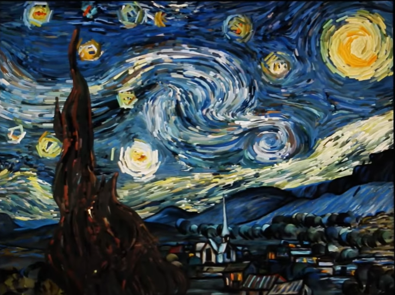
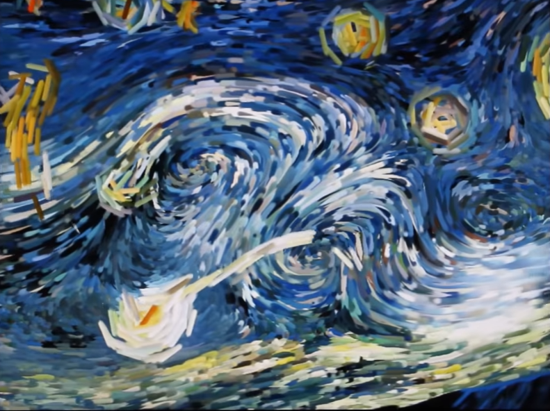
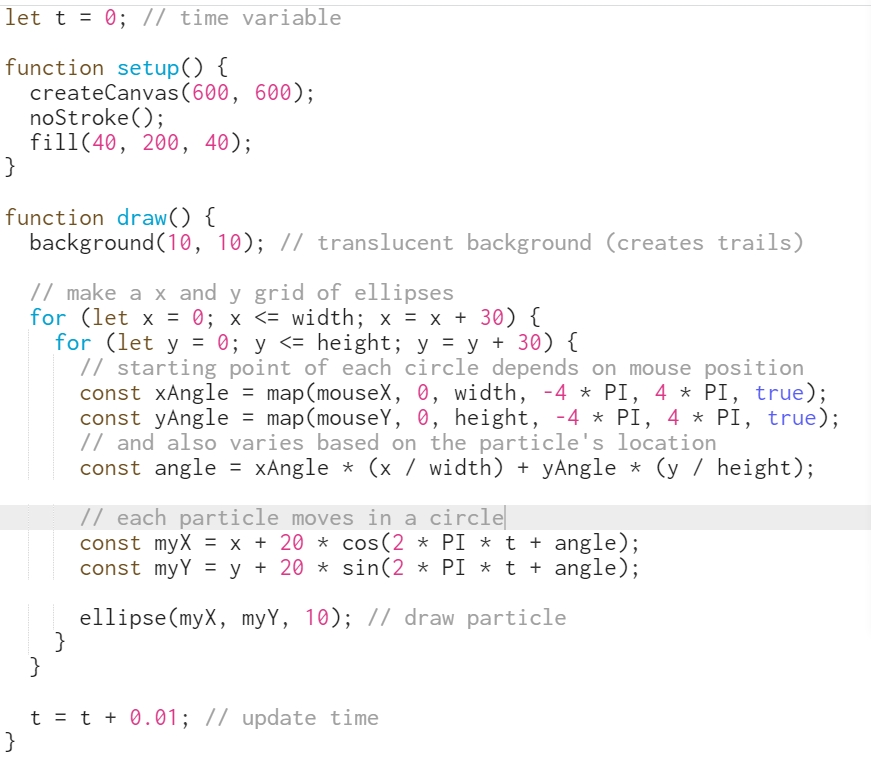
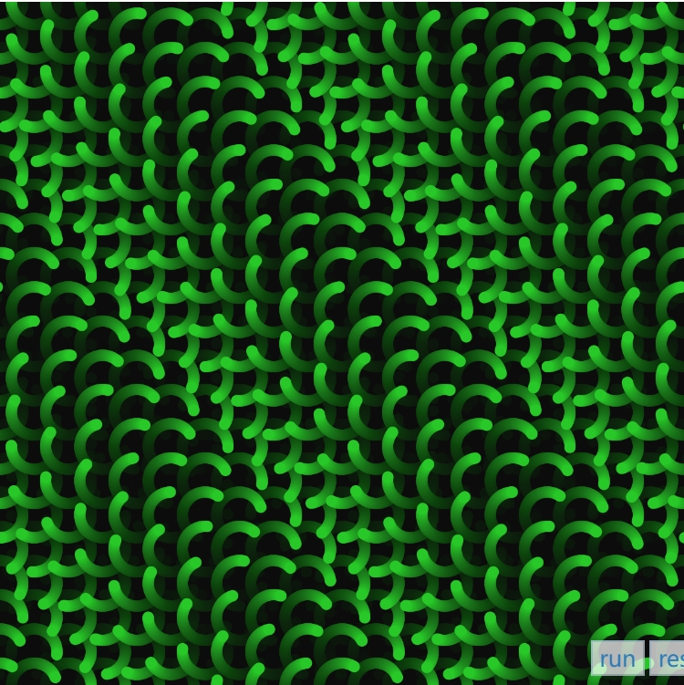
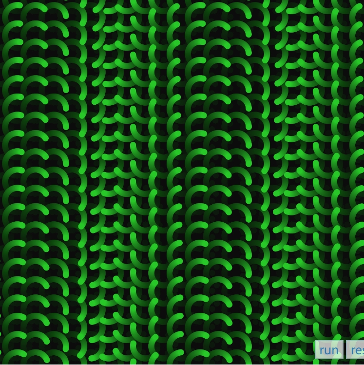

# jche7275_9103_tut6
## Imaging Technique Inspiration
We want to do design based on The Scream. In The Scream, there are a lot of curve elements. So I want to refer to the interactive animation of Starry Night. Because there are a lot of curve elements in Starry Night, too. And the designer make these curves move and changed curve paths by touching. It is interesting. So, I want to refer to it.

## Coding Technique Exploration
I want to refer to Wavemaker in p5Js to implement my design. Because it allows me to build a lot of moving waves to form a picture. Besides, these waves can change their paths by mouse, which is also match my design.

[The link to an example implementation](https://p5js.org/examples/interaction-wavemaker.html)